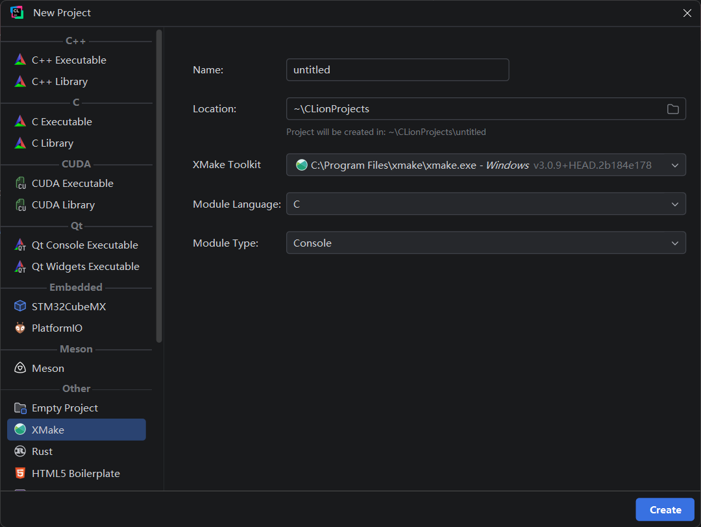
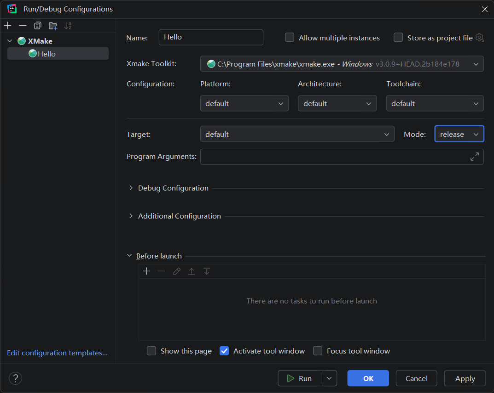

<div align="center">
  <a href="https://xmake.io">
    
  </a>

  <h1>xmake-idea</h1>

  <div>
    <a href="https://plugins.jetbrains.com/plugin/17406-xmake"></a>
    <a href="https://plugins.jetbrains.com/plugin/17406-xmake"></a>
    <a href="https://github.com/xmake-io/xmake-idea/blob/master/LICENSE.md"></a>
    <br />
    <a href="https://www.reddit.com/r/xmake/"></a>
    <a href="https://t.me/tbooxorg"></a>
    <a href="https://jq.qq.com/?_wv=1027&k=5hpwWFv"></a>
    <a href="https://discord.gg/xmake"></a>
    <a href="https://xmake.io/about/sponsor"></a>
  </div>

  <p>XMake integration for the IntelliJ Platform.</p>
</div>

## Introduction

xmake-idea integrates [XMake](https://github.com/xmake-io/xmake) with IntelliJ-based IDEs, providing a convenient way to configure, build, and run cross-platform projects.

## Requirements

The plugin requires an IntelliJ-based IDE built on IntelliJ Platform `2025.1` or later. CLion and IntelliJ IDEA are currently tested.

XMake must be installed on the machine or environment where you build the project.

## Features

- Create projects with the XMake project wizard or open an existing directory containing `xmake.lua`.
- Configure XMake installations, targets, platforms, architectures, toolchains, build modes, and runtime arguments.
- Build, rebuild, clean, and run targets from the XMake menu and toolbar.
- View build output and navigate from reported problems to the corresponding source file.
- Generate `compile_commands.json` and debug XMake targets directly in CLion.
- Run XMake in WSL and SSH environments with basic support.

## Installation

1. Install [XMake](https://xmake.io/#/guide/installation) on the machine or environment where you build the project. Add `xmake` to `PATH` for automatic detection.
2. Install [XMake from JetBrains Marketplace](https://plugins.jetbrains.com/plugin/17406-xmake) in your IntelliJ-based IDE.
3. Open or create a project, then create an XMake run configuration and select an XMake installation.

## Getting Started

### Open an Existing Project

Open the project directory in the IDE. The directory must contain an `xmake.lua` file.

### Create a New Project

Use `File > New > Project`, choose `XMake`, then configure the project location, XMake installation, module language, and module type.

<p align="center">
  
</p>

<p align="center"><em>XMake project wizard in CLion 2026.1.</em></p>

## Project Settings

Open `Settings > Build, Execution, Deployment > Xmake` to configure:

- `Toolkit`: register and manage XMake installations.
- `Compile commands path`: set the output path for `compile_commands.json`.
- `Auto-update`: update `compile_commands.json` automatically after a successful build.

The plugin generates `compile_commands.json`, which CLion can use in the project.

## Run Configurations

Create an XMake run configuration, then configure it using the fields shown in the editor:

- Select the XMake installation, platform, architecture, toolchain, target, build mode, and program arguments.
- Expand `Debug Configuration` to configure the DAP driver and launch settings.
- Expand `Additional Configuration` to configure environment variables, working and build directories, and other advanced options.

Build and run actions are also available from the XMake menu and toolbar.

<p align="center">
  
</p>

<p align="center"><em>XMake run configuration in CLion 2026.1.</em></p>

## Build Output

Select `Xmake > Build Project` to build the current project. Build output and reported problems appear in the XMake tool window. Select a problem to open the corresponding source location.

## Debugging

### DAP Debugging

In CLion 2025.1 and later, you can debug XMake targets directly with the Debug Adapter Protocol (DAP), without generating a `CMakeLists.txt` file.

1. Install a supported DAP driver:
   - `LLDB DAP`: `lldb-dap` (recommended)
   - `GDB DAP`: a `gdb` executable with DAP support
2. Open the XMake run configuration for your target.
3. In the `Debug Configuration` section:
   - Leave `Auto-detect DAP driver` enabled, or select the DAP driver executable manually.
   - Optionally override the generated launch settings in the JSON launch configuration field.
4. Click `Debug` to start. The plugin builds the target before starting the debugger.

<details>
<summary>Legacy Debugging (CMake)</summary>

For CMake-based debugging, select `Xmake > Update CmakeLists` to create or update `CMakeLists.txt`. Open the generated file in CLion and use the resulting CMake run configuration.

</details>

## Build From Source

> [!IMPORTANT]
> Use `JBR 21` as the Gradle JVM. For command-line builds, set `JAVA_HOME` to a JBR 21 installation.

Use the included Gradle wrapper to build or run the plugin from source.

### Windows

```powershell
.\gradlew.bat build
.\gradlew.bat runIde --stacktrace
```

### Linux or macOS

```bash
./gradlew build
./gradlew runIde --stacktrace
```

## Contributing

Bug reports and pull requests are welcome. See [CONTRIBUTING.md](./CONTRIBUTING.md) for issue reporting and contribution guidelines.

<br />

<table align="center">
  <tr>
    <td align="left">
      <p>Powered by</p>
      <p>
        <a href="https://jb.gg/OpenSource">
          <picture>
            <source media="(prefers-color-scheme: dark)" srcset="./res/jetbrains-white.svg" />
            <source media="(prefers-color-scheme: light)" srcset="./res/jetbrains.svg" />
            
          </picture>
        </a>
      </p>
    </td>
  </tr>
</table>
